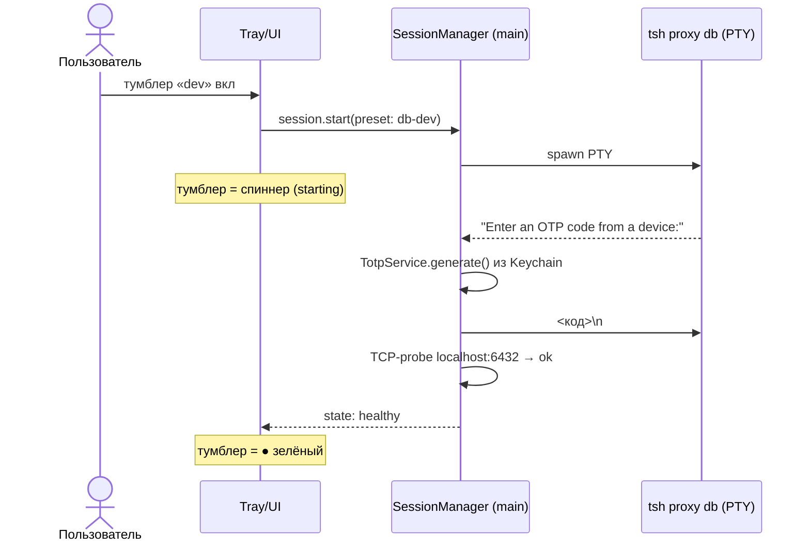

# 02 — UX-концепция

## 1. Принципы

1. **Menu-bar-first.** Приложение живёт в строке меню; иконка — агрегированный статус
   (сертификат + прокси). Окно — рабочая поверхность, которую не страшно закрывать (US-13).
2. **Два клика или один хоткей до любого частого действия.** Частые действия продублированы:
   popover в menu bar, палитра ⌘K, хоткеи.
3. **Всё — «действие» (Action).** Пользователь не видит CLI-команд, он видит «Bash → api (dev)»,
   «Прокси БД: dev», «Логи: auth». Внизу деталей всегда доступна реальная команда (для доверия и копирования).
4. **Статус всегда честный.** Любая операция дольше 200 мс показывает спиннер; тумблер прокси
   проходит видимые состояния `выкл → запускается → работает`; никакого «молча думает».
5. **Prod — красный.** Красный бейдж окружения, подтверждение перед exec/мутирующим SQL на prod.
6. **Сессии переживают окно.** Закрыл окно — в menu bar всё видно; открыл — терминалы
   восстановились с историей.

## 2. Menu bar

### Иконка-статус

| Вид       | Значение                                                          |
|-----------|-------------------------------------------------------------------|
| ● зелёная | залогинен, все включённые прокси healthy                          |
| ● жёлтая  | сертификат скоро истечёт / прокси перезапускается / идёт операция |
| ● красная | требуется перелогин / прокси упал                                 |
| ○ серая   | не залогинен, ничего не запущено                                  |

### Popover (клик по иконке)

```
┌──────────────────────────────────────────┐
│ 🟢 user@example.com   серт: 2ч 54м    │  ← клик = перелогин при необходимости
├──────────────────────────────────────────┤
│ DB PROXY (порт 6432)                     │
│   dev            [ ● вкл ]  healthy      │
│   stage          [ ○ выкл ]              │
│   prod-replica   [ ○ выкл ]  (prod 🔴)   │
│   prod           [ ○ выкл ]  (prod 🔴)   │
├──────────────────────────────────────────┤
│ KUBE: dev-k8s-cluster        [сменить ▾] │
│   ▸ Bash → api        ▸ Bash → auth      │
│   ▸ Логи → api        ▸ Логи → auth      │
├──────────────────────────────────────────┤
│ ⌘K  Все действия…                        │
│ ⌥⌘I Открыть окно     ⚙ Настройки  ✕ Выход│
└──────────────────────────────────────────┘
```

- Тумблеры работают прямо из popover; при запуске тумблер показывает спиннер до `healthy`.
- Если для действия нужен OTP/пароль и автоответ не сработал — popover раскрывает inline-поле ввода.

## 3. Главное окно

```
┌───────────┬──────────────────────────────────────────────┐
│ ОКРУЖЕНИЯ │  [dev ⌘1] [stage ⌘2] [prod 🔴 ⌘3]            │
│  ● dev    ├──────────────────────────────────────────────┤
│  ○ stage  │ Табы: [Поды] [Терминал: api] [Логи: auth] [SQL] │
│  ○ prod   │                                              │
├───────────┤   (содержимое активного таба)                │
│ РАЗДЕЛЫ   │                                              │
│  Поды     │                                              │
│  Сессии   │                                              │
│  SQL      │                                              │
│  Прокси   │                                              │
├───────────┴──────────────────────────────────────────────┤
│ статус-бар: серт 2ч54м · прокси dev:6432 ● · задачи: ⟳ 1 │
└──────────────────────────────────────────────────────────┘
```

### Раздел «Поды»

- Таблица: `имя · ready · статус · рестарты · age`; группировка по workload
  (по workload'ам конфига + «прочее»); фильтр Running по умолчанию, свежайший под каждого
  workload'а помечен бейджем `свежий`.
- Строка пода → действия: **Bash**, **Логи**, **Команда…** (one-shot), «скопировать имя».
- Заголовок: время последнего обновления + кнопка/автообновление.

### Раздел «Сессии» (терминалы)

- Список живых сессий с состоянием FSM (`running / awaiting_otp / degraded / exited`),
  табы с xterm. Закрытие таба ≠ убийство сессии (спрашивает: «отсоединить или завершить?»).

### Раздел «SQL»

- Сверху выбор окружения (подсвечивает, поднят ли туннель; если нет — кнопка «поднять»).
- Редактор запроса (⌘Enter — выполнить), результат таблицей (виртуализация строк),
  вкладка «История». `LIMIT`-подсказка, `statement_timeout` из настроек.
- Пресеты справа: `pg_dump dev`, свои сниппеты.

### Раздел «Прокси»

- Карточки пресетов: команда, порт, состояние, кнопки start/stop/restart, мини-лог вывода
  процесса, история падений/рестартов (от Supervisor).

## 4. Палитра команд (⌘K)

Единый реестр действий (Command pattern, [ADR-0004](adr/ADR-0004-core-patterns.md)) — всё, что
можно сделать в приложении, доступно из палитры с fuzzy-поиском:

```
> bash api         → Bash → api (dev)
> proxy stage      → DB-прокси: включить stage
> логи auth        → Логи → auth (follow)
> перелогин        → Teleport: перелогин
> dump             → pg_dump dev → файл…
```

Действия с параметрами («Команда в api (dev)…») спрашивают аргумент вторым шагом прямо в
палитре; Esc возвращает к списку, а не закрывает всё. Боевые действия помечены красным и
требуют подтверждения — вопрос задаёт само действие ([ADR-0010](adr/ADR-0010-actions-and-shell.md)),
поэтому в палитре, трее и на тумблерах он один и тот же.

Пустая строка в `ui.hotkeys` выключает сочетание; занятый системой глобальный хоткей не
роняет старт — приложение показывает причину в настройках.

## 5. Хоткеи (секция `ui.hotkeys` конфига, формат акселераторов Electron)

| Хоткей       | Действие                                  | Область      | Ключ в конфиге                  |
|--------------|-------------------------------------------|--------------|---------------------------------|
| ⌥⌘I          | показать/скрыть главное окно              | глобальный   | `toggleWindow`, переназначается |
| ⌘K           | палитра команд                            | в приложении | `palette`, переназначается      |
| ⌘1 / ⌘2 / ⌘3 | окружение dev / stage / prod              | окно         | `envDev/envStage/envProd`       |
| ⌘Enter       | выполнить SQL-запрос                      | SQL          | фиксированный                   |
| ⌘F           | поиск в терминале/логах                   | терминал     | фиксированный (xterm)           |

## 6. Ключевые потоки

### 6.1 Включение DB-прокси (happy path + MFA)



Фолбэк: автоответ не сработал за N секунд / код отвергнут → состояние `awaiting_otp`,
UI показывает поле ввода (popover или окно), ввод уходит в тот же PTY.

### 6.2 Протухший сертификат

1. HealthMonitor: `valid_until` близко/прошло, либо прокси перестал отвечать, либо команда
   упала с ошибкой авторизации.
2. Иконка → красная/жёлтая; баннер в окне и пункт в popover: **«Перелогин»**.
3. Клик → PTY `tsh login`, пароль+OTP подставляются автоматически; спиннер.
4. Успех → Supervisor перезапускает все сессии, помеченные `restartOnRelogin` (прокси);
   exec-сессии не трогает (их состояние потеряно бы было).

### 6.3 Bash в свежий под

1. Действие «Bash → api» (popover/⌘K/раздел Поды).
2. Спиннер: `kube login` при несовпадении кластера → `get pods -o json` → выбор свежайшего.
3. Открывается таб терминала, `exec -it … bash`; заголовок таба: `api @ 5z9b5 (dev)`.
4. Если под умер (rollout) — сессия завершилась: таб предлагает «переподключиться к свежему».

### 6.4 First-run wizard

1. Проверка `tsh` (PATH через login-shell; если не найден — поле пути).
2. Email + пароль → Keychain. Пояснение, где хранится.
3. TOTP: «создать девайс приложения» (ведёт через `tsh mfa add`, потребует код существующего
   девайса из G2FA — единственный раз) или «вставить секрет вручную».
4. Тестовый логин + `tsh status` → готово; предложение включить автозапуск при входе в систему.

## 7. Состояния загрузки и ошибки

- Кнопки-операции имеют три состояния: обычная / спиннер / результат (галка или ошибка).
- Длинные фоновые задачи (pg_dump, перелогин) — в статус-баре с прогрессом/спиннером и
  отменой, плюс системное уведомление по завершении, если окно скрыто.
- Ошибки процессов показываются с хвостом stderr и кнопкой «показать полную команду и вывод».
- Пустые состояния объясняют причину («Туннель не поднят — включить?» вместо пустой таблицы).
