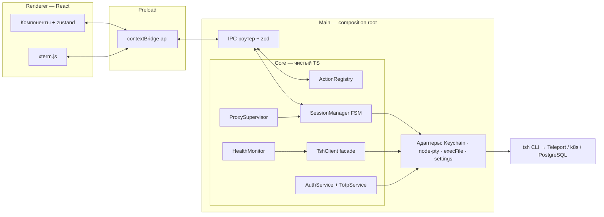
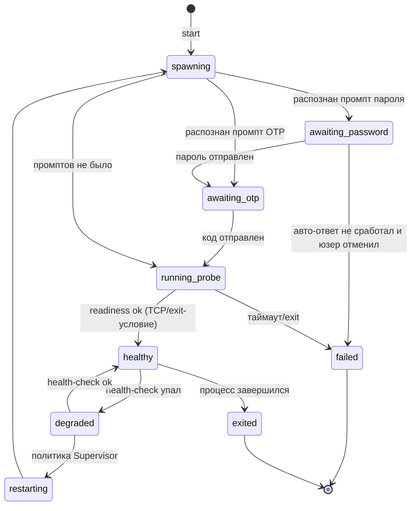
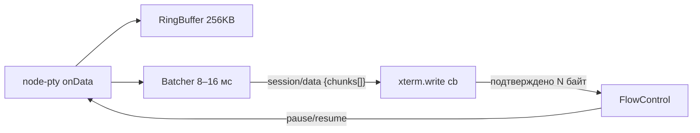

# 03 — Архитектура

Стек: **Electron 43 + TypeScript + electron-vite 5 + React** (renderer), **node-pty 1.1 +
@xterm/xterm 6** (терминал), **zustand** (состояние UI), **zod** (валидация границ),
**vitest** (тесты core). Обоснование выбора — [ADR-0001](adr/ADR-0001-electron-stack.md),
[ADR-0002](adr/ADR-0002-pty-terminal.md).

## 1. Модель процессов Electron

| Процесс                 | Ответственность                                                                                                            | Чего там НЕТ                                                      |
|-------------------------|----------------------------------------------------------------------------------------------------------------------------|-------------------------------------------------------------------|
| **main** (Node)         | Всё «ядро»: PTY-сессии, supervision, execFile-запросы к tsh, health-мониторинг, секреты/OTP, трей, глобальные хоткеи, окна | UI-логики                                                         |
| **preload**             | Узкий мост `contextBridge`: типизированные методы поверх `ipcRenderer.invoke`/`on`                                         | бизнес-логики, состояния                                          |
| **renderer** (Chromium) | Только UI: React-компоненты, xterm, zustand-зеркало состояния                                                              | Node API (`nodeIntegration: false`), секретов, прямых вызовов tsh |

Ключевые следствия:

- сессии живут в main → переживают закрытие окна (FR-S2);
- renderer sandboxed, `contextIsolation: true`, вся валидация полезных нагрузок IPC — zod с обеих сторон;
- один экземпляр приложения (`requestSingleInstanceLock`), `window-all-closed` не завершает
  приложение (живём в трее), `before-quit` гасит все дочерние процессы.

## 2. Слои и структура каталогов

Ядро отделено от Electron (гексагональная архитектура, [ADR-0004](adr/ADR-0004-core-patterns.md)):
core можно гонять в чистом Node (тесты, в перспективе — CLI или другой хост).

```
src/
├── core/                    # ЧИСТЫЙ TS/Node. Ноль импортов electron.
│   ├── domain/              # типы и модели: Session, SessionState (FSM), EnvironmentConfig,
│   │                        #   WorkloadRef, HealthStatus, Action, PromptEvent…
│   ├── ports/               # интерфейсы наружу (Ports):
│   │   ├── CredentialStore.ts    # getPassword/getTotpSecret/save… (Keychain | future API)
│   │   ├── PtyFactory.ts         # spawn(cmd,args,opts) → PtyHandle
│   │   ├── ProcessRunner.ts      # run(cmd,args,{timeout}) → {stdout,stderr,code}
│   │   ├── TextStore.ts          # файл-с-текстом: конфиг (ConfigStore) и история SQL
│   │   ├── SqlDriver.ts          # connect → query/close (M3: `pg` в туннель)
│   │   ├── TcpProbe.ts / FileStat.ts
│   │   ├── Clock.ts / Logger.ts
│   ├── services/            # прикладные сервисы (используют только ports):
│   │   ├── SessionManager.ts     # реестр сессий, FSM, ring buffers, батчинг вывода
│   │   ├── ProxySupervisor.ts    # политика рестартов, restartOnRelogin
│   │   ├── HealthMonitor.ts      # тикер: cert TTL, TCP-probes, SELECT 1
│   │   ├── KubeService.ts        # M2: kube-контекст, поды, bash/логи/one-shot
│   │   ├── SqlService.ts         # M3: запросы в туннель, история, psql, SELECT 1
│   │   ├── DumpService.ts        # M3: пресеты pg_dump, прогресс по размеру файла
│   │   ├── AuthService.ts        # login/relogin, состояние сертификата
│   │   ├── TotpService.ts        # генерация кодов (otplib) из секрета в CredentialStore
│   │   ├── PromptPipeline.ts     # цепочка PromptHandler'ов (см. §4.3)
│   │   ├── ActionRegistry.ts     # Command pattern: все действия приложения
│   │   └── ModuleRegistry.ts     # модули и contribution points (ADR-0006)
│   └── modules/
│       └── teleport/        # первый модуль: TshClient (facade), пресеты действий,
│                            #   PodSelector, конфиг окружений; будущее: grafana/, calendar/
├── main/                    # composition root (Electron main)
│   ├── adapters/            # реализации ports: SafeStorageCredentialStore, NodePtyFactory,
│   │                        #   ExecFileRunner, FileTextStore, PgSqlDriver, NetTcpProbe,
│   │                        #   FsFileStat, ShellPathResolver (см. §7)
│   ├── ipc/                 # регистрация handle/send по контракту из shared/
│   ├── tray.ts  windows.ts  hotkeys.ts  index.ts
├── preload/
│   └── index.ts             # contextBridge.exposeInMainWorld('api', …)
├── renderer/                # React-приложение
│   ├── store/               # zustand: зеркало снапшотов/событий из main
│   ├── components/          # Terminal(xterm), PodsTable, SqlConsole, ProxyCard, Palette…
│   └── views/
└── shared/                  # IPC-КОНТРАКТ: имена каналов, типы, zod-схемы.
    └── ipc.ts               #   Единственная точка правды для main/preload/renderer.
```

Правило зависимостей: `renderer → shared ← main → core`; `core` не знает ни про кого.
Нарушения ловятся eslint-правилом (`import/no-restricted-paths`).

## 3. Общая схема



## 4. Паттерны проектирования и где они применяются

| Паттерн                                | Где                                                                          | Зачем именно здесь                                                                                                                                                         |
|----------------------------------------|------------------------------------------------------------------------------|----------------------------------------------------------------------------------------------------------------------------------------------------------------------------|
| **Ports & Adapters (гексагональный)**  | `core/ports` + `main/adapters`                                               | Core тестируется без Electron; будущие замены безболезненны: Keychain→удалённый API кредов, node-pty→другой PTY, macOS→Linux/Windows (NFR-4, FR-A2)                        |
| **Command**                            | `ActionRegistry`, все пользовательские действия                              | Одно определение действия питает палитру ⌘K, popover трея, хоткеи и будущие модули; действия декларативны: `{id, title, scope, params?, run}`                              |
| **State Machine (FSM)**                | `SessionManager` — жизненный цикл сессии                                     | Промпты/падения/рестарты — явные переходы, UI просто отображает состояние; невозможные переходы отсекаются на типах (см. §4.2)                                             |
| **Supervisor**                         | `ProxySupervisor`                                                            | Долгоживущие прокси: рестарт с backoff, лимит попыток, массовый рестарт после перелогина; политика отделена от механики спавна                                             |
| **Chain of Responsibility + Strategy** | `PromptPipeline`                                                             | Поток PTY прогоняется через цепочку обработчиков промптов: Password → Totp → AskUser-фолбэк; стратегии подключаются по конфигу сессии (см. §4.3)                           |
| **Facade**                             | `TshClient`                                                                  | Все структурированные вызовы tsh (`status/db ls/kube login/get pods` + JSON-парсинг + zod) за одним типизированным интерфейсом; версия-специфичное — в одном месте (NFR-7) |
| **Observer (typed EventEmitter)**      | core → IPC push → zustand                                                    | Однонаправленный поток данных: main — источник правды, renderer — проекция                                                                                                 |
| **Repository**                         | `SessionRepository` (in-memory + ring buffers), `TextStore` (конфиг, история SQL) | Доступ к состоянию/данным за интерфейсом, а не размазан по сервисам                                                                                                        |
| **Module / Contribution points**       | `ModuleRegistry` ([ADR-0006](adr/ADR-0006-module-system.md))                 | Будущие домены (Grafana-ссылки, календарь) добавляют `actions/trayItems/views/settings` без правок ядра (NFR-5)                                                            |
| **ADR**                                | `docs/adr/`                                                                  | Решения фиксируются с контекстом; «почему так» не теряется                                                                                                                 |

Осознанно **не** используем: DI-контейнер (ручная сборка в composition root — прозрачнее для
одного разработчика), Redux/effector (zustand-зеркала достаточно — логика не в renderer),
Event Sourcing (оверкилл).

### 4.2 FSM сессии



Замечания:

- `awaiting_*` — это и есть точки фолбэка на ручной ввод: FSM стоит в состоянии, UI показывает
  inline-поле, ввод пользователя → тот же переход, что и авто-ответ.
- Для one-shot exec-запросов FSM не используется — это обычный `ProcessRunner.run` с таймаутом.
- Реализация M2: переход `spawning → running` происходит по **первому выводу процесса**, если
  в нём не распознан промпт (пайплайн кормится раньше перехода). Иначе неинтерактивные сессии
  (kube exec/логи) навсегда оставались бы в «запускается».
- Реализация M1: `restarting` живёт на уровне **прокси** (`core/domain/proxy.ts`), а не сессии —
  каждый рестарт создаёт новый PTY, у сессии нет перехода назад в `spawning`. Прокси — это
  пресет с жизненным циклом поверх сменяющихся сессий (ProxySupervisor — единственный владелец
  его состояния и probe-циклов; HealthMonitor занимается только сертификатом).

### 4.3 PromptPipeline (цепочка обработчиков)

Поток PTY (только для сессий с `auth: true`) сканируется построчно/по чанкам:

```ts
interface PromptHandler {
    match(buf: string): PromptKind | null;     // 'password' | 'otp' | …
    handle(session, kind): Promise<Answered | Pass>;
}

// порядок: PasswordHandler → TotpHandler → AskUserHandler (терминальный)
```

- Паттерны промптов — константы модуля teleport с фикстурными тестами (`Enter password for
  Teleport user`, `Enter an OTP code from a device`) — см. [04, §4](04-tsh-integration.md#4-аутентификация-и-mfa).
- `TotpHandler` повторяет попытку один раз на границе следующего 30-секундного окна, если код
  отвергнут; дальше передаёт AskUser.
- Секрет/пароль никогда не попадают в ring buffer: обработчик помечает диапазон как
  замаскированный до эха промпта (tsh не эхоит ввод, маскирование — защита в глубину).

## 5. IPC-контракт

Весь контракт — в `src/shared/ipc.ts`: имена каналов, типы запрос/ответ, zod-схемы; main
регистрирует обработчики строго по контракту, preload генерирует API из него же (никаких
строковых каналов россыпью по коду).

### RPC (`ipcRenderer.invoke`)

| Канал                                           | Запрос → Ответ                                                                                              |
|-------------------------------------------------|-------------------------------------------------------------------------------------------------------------|
| `session.start`                                 | `{presetId \| spec}` → `{sessionId}`                                                                        |
| `session.write`                                 | `{id, data}` → `void` (ввод с клавиатуры xterm)                                                             |
| `session.resize`                                | `{id, cols, rows}` → `void`                                                                                 |
| `session.stop` / `session.detach`               | `{id}` → `void`                                                                                             |
| `session.setPaused`                             | `{id, paused}` → `void` (пауза follow-логов; сильнее backpressure)                                          |
| `session.snapshot`                              | `{id}` → `{state, ringBuffer}` (при переоткрытии окна)                                                      |
| `auth.login`                                    | `{}` → `{ok}` (перелогин; прогресс — событиями)                                                             |
| `auth.submitPrompt`                             | `{sessionId, kind, value}` → `void` (ручной фолбэк)                                                         |
| `tsh.status` / `proxy.*`                        | … → типизированные DTO                                                                                      |
| `kube.setEnv`                                   | окружение приложения (KubeService — владелец, состояние приходит событием)                                  |
| `kube.pods`                                     | `{env, force?}` → `{pods, freshest, fetchedAt, cluster}` \| `{error, needsLogin}`; ответ кэшируется на 15 с |
| `kube.bash` / `kube.logs` / `kube.execPty`      | `{env, workloadId, pod?}` → `{session, meta}` \| ошибка                                                     |
| `kube.exec`                                     | `{…, command}` → `{stdout, stderr, code, ms}` \| `{error, needsPty}`                                        |
| `sql.exec`                                      | `{presetId, query, confirmed?}` → `{columns, rows, ms, truncated, readOnly}` \| `{reason, error}`           |
| `sql.history` / `sql.clearHistory`              | история запросов (persist в `<userData>/sql-history.json`)                                                 |
| `sql.psql` / `sql.dump`                         | `{presetId}` / `{dumpId, presetId}` → `{session}` (PTY-таб; файл дампа выбирается диалогом в main)         |
| `actions.list` / `actions.run`                  | палитра ⌘K                                                                                                  |
| `settings.get` / `settings.save` / `creds.save` | …                                                                                                           |

### События (`webContents.send`, main → renderer)

| Канал           | Полезная нагрузка                                                 |
|-----------------|-------------------------------------------------------------------|
| `session/data`  | `{id, chunks: string[]}` — батч вывода PTY (см. §6)               |
| `session/state` | `{id, state, meta}` — переходы FSM                                |
| `health/update` | `{cert: {validUntil}, proxies: {...}}`                            |
| `auth/required` | `{reason}` — показать баннер перелогина                           |
| `task/progress` | `{taskId, label, state}` — статус-бар                             |
| `kube/state`    | `{view}` — окружение, кластер, «переключаю…»                      |
| `kube/session`  | `{sessionId, meta}` — привязка сессии к поду (null = сессия ушла) |
| `sql/dump`      | `{task}` — прогресс дампа (размер файла) и его финал              |

Правила: renderer никогда не вызывает tsh и не видит секретов; все мутации идут через main;
события — единственный способ обновления zustand-стора (снапшот при подключении + дельты).

## 6. Поток данных PTY и производительность

Проблема: `kubectl logs --follow` может давать тысячи чанков/сек; наивная пересылка каждым
IPC-сообщением кладёт UI.



- **Батчинг**: накапливаем в main, сбрасываем таймером 8–16 мс или по размеру буфера.
- **Backpressure**: renderer подтверждает переваренные байты через колбэк `xterm.write`;
  при отставании > порога main вызывает `pty.pause()`, при разгрузке — `resume()`.
- **Рендер**: `@xterm/addon-webgl` с автоматическим фолбэком на DOM-рендерер при потере
  WebGL-контекста.
- **Восстановление окна**: `session.snapshot` → replay ring buffer в свежий xterm (сырые байты
  сохраняют цвета/позиционирование). `@xterm/headless`+serialize — осознанно отложен
  ([ADR-0002](adr/ADR-0002-pty-terminal.md)).
- ~~Для follow-логов (не интерактив) PTY не нужен — обычный spawn~~ → в M2 решено иначе:
  логи тоже идут PTY-сессией (переиспользуют весь механизм выше и переживают промпт MFA),
  см. [ADR-0007](adr/ADR-0007-kube-streams-via-pty.md). Ручная пауза потока
  (`session.setPaused`) живёт поверх flow-control'ной и снимается только пользователем.

## 7. Секреты и безопасность

- Хранение: Electron **`safeStorage`** (на macOS ключ шифрования — в Keychain) → зашифрованные
  blob'ы в `userData/secrets.bin`. Не keytar (не поддерживается) — [ADR-0003](adr/ADR-0003-secrets-and-totp.md).
- TOTP: свой девайс приложения в Teleport (`tsh mfa add --type TOTP`), секрет только в main,
  коды генерирует `otplib`, ответ пишется напрямую в PTY. Renderer видит только событие
  «код подставлен».
- Пароль/секреты никогда: в renderer, в IPC-событиях, в логах, в конфиг-JSON, в ring buffer.
- BrowserWindow: `sandbox: true`, `contextIsolation: true`, `nodeIntegration: false`,
  `webSecurity: true`; навигация наружу запрещена (`will-navigate` → deny, внешние ссылки —
  `shell.openExternal` по allowlist).
- Слой IPC валидирует вход zod'ом; неизвестные каналы/полезные нагрузки отбрасываются.

## 8. PATH и окружение процессов (классические грабли macOS)

Приложение, запущенное из Finder/Dock, не получает PATH из `.zshrc` → `tsh` «не найден»,
хотя в терминале работает.

Решение (`ShellPathResolver` в адаптерах): один раз на старте выполнить
`$SHELL -ilc 'command -v tsh; env'`, закэшировать PATH/окружение и передавать его всем
спавнам; в настройках — явный override пути к `tsh` (FR-C3). Библиотеки типа `fix-path`
не тянем — логика в 20 строк и под контролем.

## 9. Кроссплатформенность (задел)

| Платформенное | Абстракция                   | macOS сейчас                 | Позже                                                |
|---------------|------------------------------|------------------------------|------------------------------------------------------|
| Секреты       | `CredentialStore`-шифрование | safeStorage→Keychain         | DPAPI (win) / libsecret (linux) — тот же safeStorage |
| PTY           | `PtyFactory`                 | forkpty                      | ConPTY (win) — поддержан node-pty                    |
| Трей/иконки   | `main/tray.ts`               | NSStatusItem template-иконки | Tray win/linux                                       |
| Хоткеи        | `globalShortcut`             | ⌥⌘I                          | другие дефолты                                       |
| PATH-резолв   | `ShellPathResolver`          | login-shell zsh              | PATHEXT/where (win)                                  |
| Автозапуск    | `app.setLoginItemSettings`   | ✓                            | реестр/systemd                                       |

Core и модули не содержат `process.platform`-ветвлений — только адаптеры.

## 10. Тестирование

| Уровень          | Что                                                                                                                                            | Чем                     |
|------------------|------------------------------------------------------------------------------------------------------------------------------------------------|-------------------------|
| Unit (core)      | FSM-переходы, PromptPipeline на фикстурах реального вывода tsh, PodSelector (маски/свежайший), парсеры JSON, TotpService (фиксированное время) | vitest, без Electron    |
| Интеграционные   | SessionManager + Supervisor против **фейкового tsh** (bash-скрипт, эмулирующий промпты/падения/зависания)                                      | vitest + node-pty       |
| E2E (позже, M4+) | смоук: запуск окна, палитра, тумблер с фейковым tsh                                                                                            | Playwright for Electron |

Фикстуры вывода tsh лежат в `core/modules/teleport/__fixtures__/` и обновляются при смене
версии Teleport (NFR-7).

## 11. Сборка и дистрибуция

- **Dev**: electron-vite (HMR renderer, автоперезапуск main).
- **Пакет**: electron-builder → dmg + zip (arm64; universal — при необходимости).
  node-pty 1.1 — N-API с prebuild'ами (fallback `node-gyp rebuild`), жёсткая привязка к ABI
  Electron и обязательный `@electron/rebuild` ушли ([ADR-0002](adr/ADR-0002-pty-terminal.md)).
- **Подпись/нотаризация** (M5): Developer ID, hardenedRuntime + entitlements
  (`allow-jit`, `allow-unsigned-executable-memory`), notarytool через electron-builder.
- **Обновления** (M5): electron-updater + GitHub Releases.
